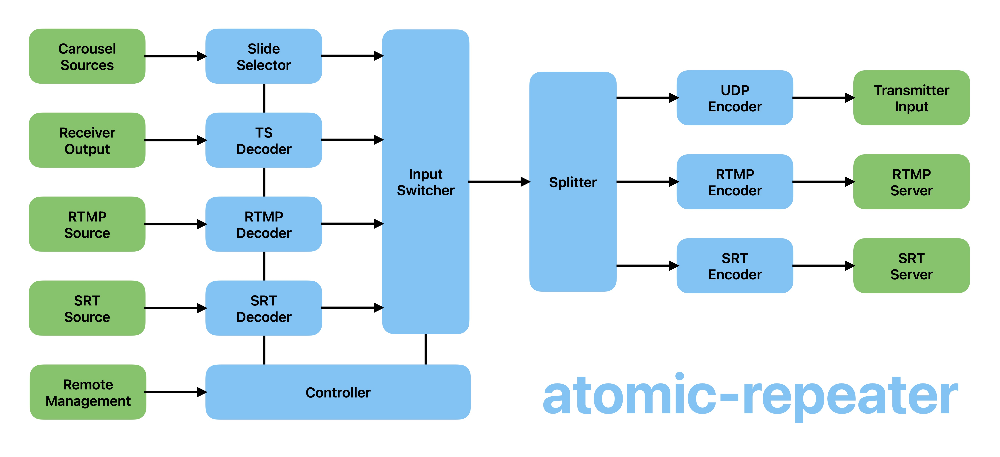

# atomic-repeater

## Work in Progress
- This is simply a holding page until ready to publish
- ED7TMP Repeater is on the BATC Streamer when testing

## Intent
- An easy to build DATV repeater
- Minumum external hardware
- No hardware encoder(s)
- No HDMI Switch or cables
- ADALM-PLUTO or LibreSDR for TX and RX
- Network inputs & outputs for RTMP & SRT
- Fully configurable from a single config file
- Network remote management
